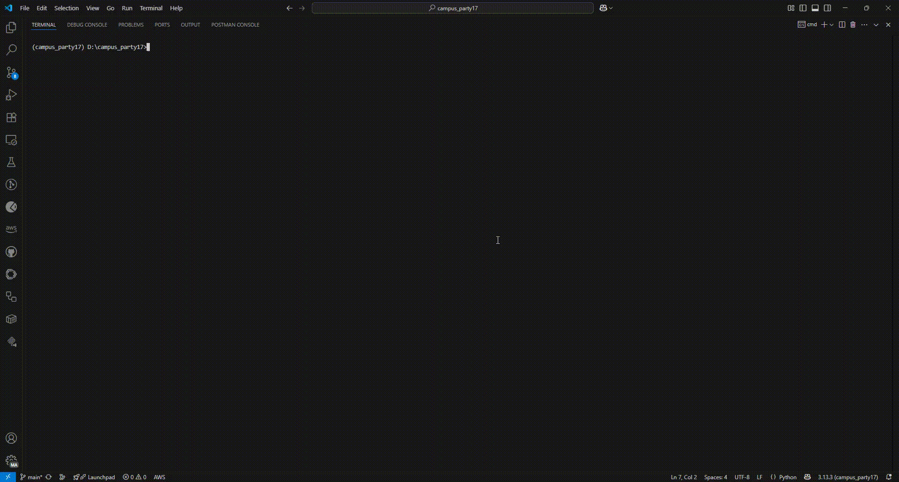
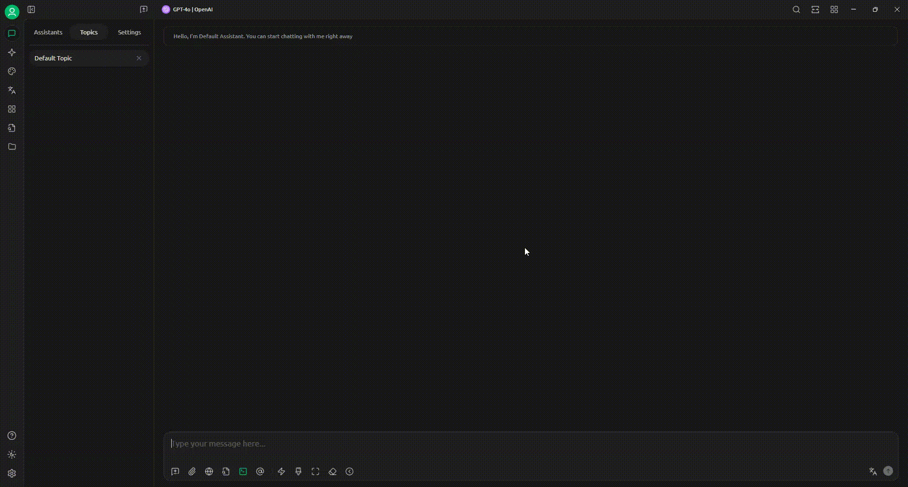

# campus_party17
Momento HowTo apresentado no Campus Party 17 2025 - Brasília
Marcelo Markus


# Guia de Instalação

Este guia descreve como instalar o [uv](https://github.com/astral-sh/uv), criar um ambiente virtual com `venv`, adicionar a biblioteca [fastmcp](https://pypi.org/project/fastmcp/) e acessar referências úteis.

## 1. Instalar o `uv`

```bash
# On macOS and Linux.
curl -LsSf https://astral.sh/uv/install.sh | sh
```

```bash
# On Windows.
powershell -ExecutionPolicy ByPass -c "irm https://astral.sh/uv/install.ps1 | iex"
```
Caso já tenha instalado o `uv` anteriormente, você pode atualizar para a versão mais recente.

```bash
uv self update
```


## 2. Criar Ambiente Virtual com uv

```bash
uv venv
```

Ative o ambiente virtual:

- **Windows:**  
    ```bash
    .venv\Scripts\activate
    ```
- **Linux/macOS:**  
    ```bash
    source .venv/bin/activate
    ```

## 3. Instalar a biblioteca `fastmcp`

Com o ambiente virtual ativado, execute:

```bash
uv add fastmcp
```

## 4. Executar server `fastmcp`

Para iniciar o servidor com exemplo de uso de tools, execute:

```bash
uv run main.py
```



Para iniciar o servidor com exemplo de integração de API, execute:

```bash
uv run api.py
```

## 5. Cliente

Para conectar o cliente ao Server, adicione o seguinte código nas configurações MCP Server:

Cherry Studio - MCP Server
```
{
    "mcpServers":{
        "mcpCampusParty":{
            "type":"sse",
            "url": "http://localhost:8000/sse"
        }
    }
}
```


## 6. Referências

- [uv - GitHub](https://github.com/astral-sh/uv)
- [fastmcp - PyPI](https://pypi.org/project/fastmcp/)
- [Cherry Studio Download](https://www.cherry-ai.com/download)

